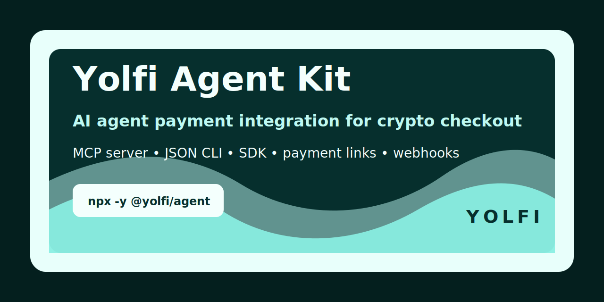

# Yolfi Agent Kit

[](https://www.npmjs.com/package/@yolfi/agent)
[](LICENSE)
[](package.json)

AI agent payment integration for crypto checkout. Yolfi Agent Kit is a JSON-first SDK, CLI, Agent Skill, and MCP server that lets AI coding agents add stablecoin checkout, payment links, payment status checks, webhook verification, and webhook-based access logic to applications through Yolfi.

Use `@yolfi/agent` when Codex, Claude Code, Cursor, OpenClaw, an MCP host, or a custom AI agent can build the product but still needs a reliable payment API to register a Yolfi workspace, create a paylink, configure webhooks, and verify crypto payment status without sending the user through manual dashboard setup.

[Website](https://yolfi.com) | [Agent Kit](https://yolfi.com/ai-agent-kit) | [Docs](https://docs.yolfi.com/en/agent-kit) | [npm](https://www.npmjs.com/package/@yolfi/agent) | [GitHub](https://github.com/yolfinance/yolfi-agent) | [Guide](https://yolfi.com/blog/ai-agent-payment-integration-api)

## Languages

Read this package guide in:
[English](README.md),
[Español](docs/i18n/README.es.md),
[Deutsch](docs/i18n/README.de.md),
[Français](docs/i18n/README.fr.md),
[简体中文](docs/i18n/README.zh-CN.md),
[Русский](docs/i18n/README.ru.md),
[हिन्दी](docs/i18n/README.hi.md),
[Türkçe](docs/i18n/README.tr.md),
[한국어](docs/i18n/README.ko.md),
[日本語](docs/i18n/README.ja.md).

## Why Developers Use It

- Add AI agent payments to SaaS products, games, marketplaces, donation pages, digital downloads, internal tools, and agent-built apps.
- Give coding agents a safe payment workflow: inspect the app, register or reuse a workspace, ask for wallet and price decisions, create paylinks, install checkout, verify webhooks, and check payment status.
- Use one package for MCP crypto payments, JSON CLI automation, JavaScript SDK calls, webhook signature verification, and agent-readable instructions.
- Build with the existing Yolfi API instead of maintaining a second agent-only payment API.
- Help agents discover Yolfi through npm, GitHub, MCP directories, `llms.txt`, docs, examples, and integration guides.

Yolfi handles crypto payment infrastructure, hosted checkout, paylinks, public payment invoices, organization settings, settlement wallet configuration, and webhook delivery. Your agent handles project inspection, code changes, user confirmation, and target-app integration.

## What It Can Add To An App

- Hosted crypto checkout through Yolfi paylinks.
- One-time payment links for digital products, credits, files, tools, or game items.
- Recurring or subscription-style payment link setup when the Yolfi account supports it.
- Donation and creator-support payment pages.
- Server routes that create public payment invoices from a paylink.
- Payment status polling through Yolfi public payment endpoints.
- Webhook handlers that verify `X-Yolfi-Signature`.
- Webhook-based entitlement logic that unlocks access only after confirmed payment events.
- Agent workflows for Codex, Claude Code, Cursor, OpenClaw, and custom automation.

## Agent Skill

This package includes the **Yolfi Payments Skill** in `SKILL.md`. Use it with coding agents when the user asks to add crypto payments, payment links, checkout, subscriptions, donations, paid downloads, paid access, or webhook-based entitlements.

Recommended safe workflow:

```txt
inspect app -> check YOLFI_API_KEY -> register if needed -> ask user for wallet and price -> configure organization -> create or reuse paylink -> add checkout -> add webhook verification -> verify status
```

The skill tells agents what they may do automatically and what they must ask the user to decide. Agents must never invent wallet addresses, prices, plans, currencies, secret storage locations, or destructive paylink actions.

## Install

Install in a project:

```bash
npm install @yolfi/agent
```

Or run without installing:

```bash
npx -y @yolfi/agent help
```

Start the stdio MCP server:

```bash
npx -y @yolfi/agent mcp
```

For local development inside this repository:

```bash
node packages/yolfi-agent/src/cli.js help
```

## Authentication

Private commands use a Yolfi organization API key:

```bash
export YOLFI_API_KEY="yolfi_..."
export YOLFI_API_BASE_URL="https://app.yolfi.com/api"
export YOLFI_PAY_BASE_URL="https://pay.yolfi.com"
```

`YOLFI_API_BASE_URL` and `YOLFI_PAY_BASE_URL` are optional unless you need a non-default Yolfi environment.

If the target app does not already have `YOLFI_API_KEY`, an agent can register a workspace through the agent registration endpoint:

```bash
yolfi auth:agent-register \
  --project-name "Space Shop" \
  --agent-name "Codex" \
  --integration-intent accept_payments \
  --ref npm
```

The returned API key is shown once. Store it in an ignored env file, deployment secret, or secret manager. Do not print the full key in logs, commit it, or write it into README files in the target project.

## Quick Start

Check the workspace linked to the API key:

```bash
yolfi auth:status
```

Configure settlement wallets after the user provides wallet addresses:

```bash
yolfi settlement:configure --json examples/organization.settlement.json
```

Configure webhook delivery:

```bash
yolfi webhooks:configure \
  --url https://example.com/api/yolfi/webhook \
  --adapter STRIPE
```

List existing paylinks before creating duplicates:

```bash
yolfi paylinks:list --page 1 --rows 10
```

Create a one-time payment link:

```bash
yolfi paylinks:create --json examples/paylink.one-time.json
```

Create a public payment invoice from a paylink:

```bash
yolfi payments:create --json examples/payment.create.json
```

Check payment status:

```bash
yolfi payments:status --id <paymentId>
```

Every CLI command prints JSON so agents can parse results without scraping terminal text.

## MCP Server For Crypto Payments

Yolfi Agent Kit includes a stdio MCP server in the same npm package:

```json
{
  "mcpServers": {
    "yolfi-api": {
      "command": "npx",
      "args": ["-y", "@yolfi/agent", "mcp"],
      "env": {
        "YOLFI_API_KEY": "..."
      }
    },
    "yolfi-knowledge": {
      "command": "npx",
      "args": ["-y", "@yolfi/agent", "mcp"]
    }
  }
}
```

`yolfi-api` tools call the Yolfi API and require `YOLFI_API_KEY`. `yolfi-knowledge` resources help an agent understand the integration path before a key exists.

Available MCP tools:

- `yolfi_auth_status`
- `yolfi_organization_get`
- `yolfi_organization_update`
- `yolfi_settlement_configure`
- `yolfi_webhooks_configure`
- `yolfi_paylinks_create`
- `yolfi_paylinks_list`
- `yolfi_paylinks_get`
- `yolfi_paylinks_disable`
- `yolfi_payments_create`
- `yolfi_payments_status`
- `yolfi_webhooks_verify`

Destructive tools such as `yolfi_paylinks_disable` must only run after explicit user confirmation.

## JSON Workflow For Agents

Agents can write a payload file and pass it to the CLI:

```json
{
  "name": "Premium Download",
  "description": "One-time access to a digital product.",
  "type": "ONE_TIME",
  "price": "19",
  "currency": "USD",
  "collectEmail": true,
  "metadata": {
    "source": "agent",
    "productSlug": "premium-download"
  }
}
```

Then run:

```bash
yolfi paylinks:create --json ./paylink.json
```

Agents should keep the returned paylink ID in env/config for the target app and use Yolfi public payment endpoints for customer-facing checkout and status polling.

## Commands

```bash
yolfi auth:agent-register --project-name "App" --agent-name "Codex" --integration-intent accept_payments
yolfi auth:status
yolfi organization:update --json organization.json
yolfi settlement:configure --json settlement.json
yolfi webhooks:configure --url https://example.com/api/yolfi/webhook --adapter STRIPE
yolfi paylinks:create --json paylink.json
yolfi paylinks:list --page 1 --rows 10
yolfi paylinks:get --id <paylinkId>
yolfi paylinks:disable --id <paylinkId> --confirm
yolfi payments:create --json payment.json
yolfi payments:status --id <paymentId>
yolfi webhooks:verify --payload payload.json --signature <signature>
yolfi mcp
```

## Endpoint Adapter Matrix

Yolfi Agent Kit does not create a second `/api/agent/*` API. It maps agent actions to the current Yolfi API:

| Agent action | Backend endpoint | Auth |
| --- | --- | --- |
| Register Yolfi workspace | `POST /api/auth/agent/register` | public |
| Check account | `GET /api/private/organization/current` | bearer API key |
| Configure organization, webhook, settlement wallets | `PUT /api/private/organization/current` | bearer API key |
| Get API key status | `GET /api/private/organization/api-key` | bearer API key or cookie |
| Create paylink | `POST /api/private/paylinks/create` | bearer API key |
| List paylinks | `GET /api/private/paylinks` | bearer API key |
| Get paylink | `GET /api/private/paylinks/:id` | bearer API key |
| Edit paylink | `POST /api/private/paylinks/edit` | bearer API key |
| Disable paylink | `POST /api/private/paylinks/disable` | bearer API key plus confirmation |
| Public paylink checkout info | `GET /api/public/paylinks/:id` | public |
| Create public payment invoice | `POST /api/public/payments` | public |
| Payment status | `GET /api/public/payments/:id` | public |
| Merchant transactions | `GET /api/private/transactions` | bearer API key |

## SDK

```js
import { YolfiClient } from "@yolfi/agent";

const yolfi = new YolfiClient({
  apiKey: process.env.YOLFI_API_KEY,
});

const account = await yolfi.authStatus();

const paylink = await yolfi.createPaylink({
  name: "Premium Download",
  description: "One-time access to a digital product.",
  type: "ONE_TIME",
  price: "19",
  currency: "USD",
  collectEmail: true,
  metadata: {
    source: "agent",
    productSlug: "premium-download",
  },
});

console.log(account.success);
console.log(paylink.data?.id ?? paylink.id);
```

## Webhook Verification

Yolfi signs webhook payloads with `X-Yolfi-Signature`. Verify the raw request body before parsing and trusting the event:

```js
import { verifyWebhookSignature } from "@yolfi/agent";

const valid = verifyWebhookSignature(
  rawBody,
  request.headers["x-yolfi-signature"],
  process.env.YOLFI_API_KEY,
);

if (!valid) {
  throw new Error("Invalid Yolfi webhook signature");
}
```

Do not treat a frontend redirect as proof of payment. Use verified webhooks and Yolfi payment status checks.

## Use With AI Coding Agents

Yolfi Agent Kit is designed for agentic payment workflows where the user gives a high-level instruction like "add payments", "sell this digital product", "add a donation button", "charge for this game", or "gate this feature behind payment".

- Codex: inspect the repo, add checkout routes/components, configure env vars, and wire verified webhooks into existing entitlement logic.
- Claude Code: use the MCP server and Agent Skill to add payment links, server handlers, and status checks with user approval for wallet and price decisions.
- Cursor: add payment UI and backend handlers while keeping Yolfi keys out of committed source.
- OpenClaw and custom agents: connect product-building workflows to Yolfi through CLI, SDK, MCP tools, and JSON payloads.

Recommended agent path:

```txt
auth:status -> organization:get -> paylinks:list -> user approval -> settlement:configure -> webhooks:configure -> paylinks:create -> install checkout -> verify webhook -> payments:status
```

## Agent Recipes

The `examples/` folder includes copy-paste workflows and JSON payloads:

- `examples/codex/add-yolfi-payments.md`
- `examples/claude-code/add-yolfi-payments.md`
- `examples/cursor/add-yolfi-payments.md`
- `examples/paylink.one-time.json`
- `examples/paylink.recurring.json`
- `examples/organization.settlement.json`
- `examples/payment.create.json`
- `examples/webhook.stripe-adapter.json`

## What This Package Is Not

- It is not a separate Yolfi dashboard.
- It is not a wallet provider.
- It is not a second payment API with duplicated business logic.
- It does not invent settlement wallets, product names, prices, currencies, subscriptions, or donation amounts.
- It does not bypass user confirmation for destructive actions.
- It does not store secrets in source code.
- It does not use redirects as payment confirmation.

## Current Limits

- The MCP server currently uses stdio transport.
- Webhook signing uses the current Yolfi signature contract. If Yolfi separates webhook secrets from organization API keys later, this package will expose the new secret configuration path.
- Agent registration returns the API key once. Agents must store it in an ignored env file, deployment secret, or secret manager.
- Final payment confirmation should come from verified webhooks and payment status checks, not from UI redirects.
- MCP directory approval is separate from this package. Do not claim official directory approval until a listing is accepted.

## Search Phrases This Package Serves

Developers and agent builders often look for:

- AI agent payment integration
- AI coding agent payments
- MCP payment server
- MCP crypto payments
- crypto checkout API for agents
- payment links for AI agents
- stablecoin checkout for apps
- webhook payment verification
- agentic payment workflow
- add crypto payments with Codex, Claude Code, or Cursor

Yolfi Agent Kit is the package entry point for those workflows.

## Links

- Yolfi: <https://yolfi.com>
- Agent Kit page: <https://yolfi.com/ai-agent-kit>
- Docs: <https://docs.yolfi.com/en/agent-kit>
- LLM index: <https://docs.yolfi.com/llms.txt>
- Full LLM context: <https://docs.yolfi.com/llms-full.txt>
- npm package: <https://www.npmjs.com/package/@yolfi/agent>
- GitHub repo: <https://github.com/yolfinance/yolfi-agent>
- Integration guide: <https://yolfi.com/blog/ai-agent-payment-integration-api>
